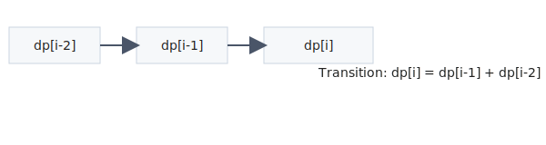
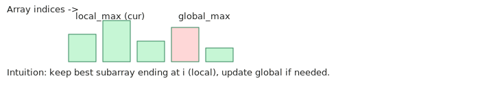
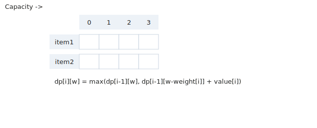
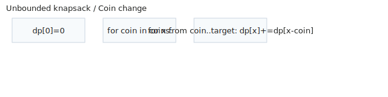
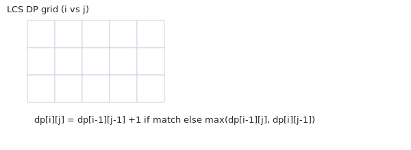
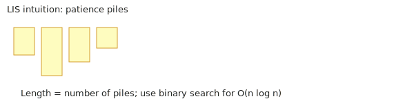
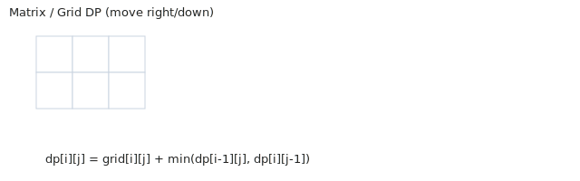
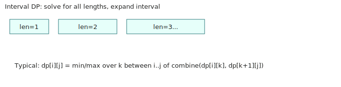

## Fibonacci / Linear Recurrence
- [70. Climbing Stairs](https://leetcode.com/problems/climbing-stairs/)
- [509. Fibonacci Number](https://leetcode.com/problems/fibonacci-number/)
- [746. Min Cost Climbing Stairs](https://leetcode.com/problems/min-cost-climbing-stairs/)
- [91. Decode Ways](https://leetcode.com/problems/decode-ways/)
- [198. House Robber](https://leetcode.com/problems/house-robber/)
- [213. House Robber II](https://leetcode.com/problems/house-robber-ii/)
- [256. Paint House](https://leetcode.com/problems/paint-house/)
- [276. Paint Fence](https://leetcode.com/problems/paint-fence/)
- [265. Paint House II](https://leetcode.com/problems/paint-house-ii/)
- [801. Minimum Swaps To Make Sequences Increasing](https://leetcode.com/problems/minimum-swaps-to-make-sequences-increasing/)

## Kadane / Max Subarray
- [53. Maximum Subarray](https://leetcode.com/problems/maximum-subarray/)
- [152. Maximum Product Subarray](https://leetcode.com/problems/maximum-product-subarray/)
- [918. Maximum Sum Circular Subarray](https://leetcode.com/problems/maximum-sum-circular-subarray/)
- [121. Best Time to Buy and Sell Stock](https://leetcode.com/problems/best-time-to-buy-and-sell-stock/)
- [122. Best Time to Buy and Sell Stock II](https://leetcode.com/problems/best-time-to-buy-and-sell-stock-ii/)
- [309. Best Time to Buy and Sell Stock with Cooldown](https://leetcode.com/problems/best-time-to-buy-and-sell-stock-with-cooldown/)
- [714. Best Time to Buy and Sell Stock with Fee](https://leetcode.com/problems/best-time-to-buy-and-sell-stock-with-fee/)
- [123. Best Time to Buy and Sell Stock III](https://leetcode.com/problems/best-time-to-buy-and-sell-stock-iii/)
- [188. Best Time to Buy and Sell Stock IV](https://leetcode.com/problems/best-time-to-buy-and-sell-stock-iv/)
- [689. Maximum Sum of 3 Non-Overlapping Subarrays](https://leetcode.com/problems/maximum-sum-of-3-non-overlapping-subarrays/)

## 0/1 Knapsack
- [416. Partition Equal Subset Sum](https://leetcode.com/problems/partition-equal-subset-sum/)
- [494. Target Sum](https://leetcode.com/problems/target-sum/)
- [1049. Last Stone Weight II](https://leetcode.com/problems/last-stone-weight-ii/)
- [474. Ones and Zeroes](https://leetcode.com/problems/ones-and-zeroes/)
- [879. Profitable Schemes](https://leetcode.com/problems/profitable-schemes/)
- [139. Word Break](https://leetcode.com/problems/word-break/)
- [2218. Maximum Value of K Coins From Piles](https://leetcode.com/problems/maximum-value-of-k-coins-from-piles/)
- [935. Knight Dialer](https://leetcode.com/problems/knight-dialer/)
- [1449. Form Largest Integer With Digits That Add up to Target](https://leetcode.com/problems/form-largest-integer-with-digits-that-add-up-to-target/)
- [698. Partition to K Equal Sum Subsets](https://leetcode.com/problems/partition-to-k-equal-sum-subsets/)

## Unbounded Knapsack / Coin Change
- [322. Coin Change](https://leetcode.com/problems/coin-change/)
- [518. Coin Change II](https://leetcode.com/problems/coin-change-ii/)
- [279. Perfect Squares](https://leetcode.com/problems/perfect-squares/)
- [377. Combination Sum IV](https://leetcode.com/problems/combination-sum-iv/)
- [983. Minimum Cost For Tickets](https://leetcode.com/problems/minimum-cost-for-tickets/)
- [139. Word Break](https://leetcode.com/problems/word-break/)
- [740. Delete and Earn](https://leetcode.com/problems/delete-and-earn/)
- [1277. Count Square Submatrices with All Ones](https://leetcode.com/problems/count-square-submatrices-with-all-ones/)
- [1043. Partition Array for Maximum Sum](https://leetcode.com/problems/partition-array-for-maximum-sum/)
- [343. Integer Break](https://leetcode.com/problems/integer-break/)

## LCS / String Pair DP
- [1143. Longest Common Subsequence](https://leetcode.com/problems/longest-common-subsequence/)
- [72. Edit Distance](https://leetcode.com/problems/edit-distance/)
- [115. Distinct Subsequences](https://leetcode.com/problems/distinct-subsequences/)
- [712. Minimum ASCII Delete Sum for Two Strings](https://leetcode.com/problems/minimum-ascii-delete-sum-for-two-strings/)
- [583. Delete Operation for Two Strings](https://leetcode.com/problems/delete-operation-for-two-strings/)
- [1092. Shortest Common Supersequence](https://leetcode.com/problems/shortest-common-supersequence/)
- [97. Interleaving String](https://leetcode.com/problems/interleaving-string/)
- [1035. Uncrossed Lines](https://leetcode.com/problems/uncrossed-lines/)
- [1458. Max Dot Product of Two Subsequences](https://leetcode.com/problems/max-dot-product-of-two-subsequences/)
- [392. Is Subsequence](https://leetcode.com/problems/is-subsequence/)

## LIS / Sequence DP
- [300. Longest Increasing Subsequence](https://leetcode.com/problems/longest-increasing-subsequence/)
- [354. Russian Doll Envelopes](https://leetcode.com/problems/russian-doll-envelopes/)
- [646. Maximum Length of Pair Chain](https://leetcode.com/problems/maximum-length-of-pair-chain/)
- [673. Number of Longest Increasing Subsequence](https://leetcode.com/problems/number-of-longest-increasing-subsequence/)
- [1048. Longest String Chain](https://leetcode.com/problems/longest-string-chain/)
- [368. Largest Divisible Subset](https://leetcode.com/problems/largest-divisible-subset/)
- [960. Delete Columns to Make Sorted III](https://leetcode.com/problems/delete-columns-to-make-sorted-iii/)
- [2407. Longest Increasing Subsequence II](https://leetcode.com/problems/longest-increasing-subsequence-ii/)
- [1626. Best Team With No Conflicts](https://leetcode.com/problems/best-team-with-no-conflicts/)
- [1187. Make Array Strictly Increasing](https://leetcode.com/problems/make-array-strictly-increasing/)

## Palindrome / Substring DP
- [5. Longest Palindromic Substring](https://leetcode.com/problems/longest-palindromic-substring/)
- [516. Longest Palindromic Subsequence](https://leetcode.com/problems/longest-palindromic-subsequence/)
- [647. Palindromic Substrings](https://leetcode.com/problems/palindromic-substrings/)
- [131. Palindrome Partitioning](https://leetcode.com/problems/palindrome-partitioning/)
- [132. Palindrome Partitioning II](https://leetcode.com/problems/palindrome-partitioning-ii/)
- [730. Count Different Palindromic Subsequences](https://leetcode.com/problems/count-different-palindromic-subsequences/)
- [1745. Palindrome Partitioning IV](https://leetcode.com/problems/palindrome-partitioning-iv/)
- [1278. Palindrome Partitioning III](https://leetcode.com/problems/palindrome-partitioning-iii/)
- [680. Valid Palindrome II](https://leetcode.com/problems/valid-palindrome-ii/)
- [125. Valid Palindrome](https://leetcode.com/problems/valid-palindrome/)

## Matrix / 2D Grid DP
- [62. Unique Paths](https://leetcode.com/problems/unique-paths/)
- [63. Unique Paths II](https://leetcode.com/problems/unique-paths-ii/)
- [64. Minimum Path Sum](https://leetcode.com/problems/minimum-path-sum/)
- [120. Triangle](https://leetcode.com/problems/triangle/)
- [221. Maximal Square](https://leetcode.com/problems/maximal-square/)
- [931. Minimum Falling Path Sum](https://leetcode.com/problems/minimum-falling-path-sum/)
- [174. Dungeon Game](https://leetcode.com/problems/dungeon-game/)
- [85. Maximal Rectangle](https://leetcode.com/problems/maximal-rectangle/)
- [64. Minimum Path Sum](https://leetcode.com/problems/minimum-path-sum/)
- [64. Minimum Path Sum](https://leetcode.com/problems/minimum-path-sum/)

## Interval / Range DP
- [312. Burst Balloons](https://leetcode.com/problems/burst-balloons/)
- [1000. Minimum Cost to Merge Stones](https://leetcode.com/problems/minimum-cost-to-merge-stones/)
- [486. Predict the Winner](https://leetcode.com/problems/predict-the-winner/)
- [546. Remove Boxes](https://leetcode.com/problems/remove-boxes/)
- [664. Strange Printer](https://leetcode.com/problems/strange-printer/)
- [516. Longest Palindromic Subsequence](https://leetcode.com/problems/longest-palindromic-subsequence/)
- [1039. Minimum Score Triangulation of Polygon](https://leetcode.com/problems/minimum-score-triangulation-of-polygon/)
- [1130. Minimum Cost Tree From Leaf Values](https://leetcode.com/problems/minimum-cost-tree-from-leaf-values/)
- [1547. Minimum Cost to Cut a Stick](https://leetcode.com/problems/minimum-cost-to-cut-a-stick/)
- [410. Split Array Largest Sum](https://leetcode.com/problems/split-array-largest-sum/)

## Bitmask DP
- [698. Partition to K Equal Sum Subsets](https://leetcode.com/problems/partition-to-k-equal-sum-subsets/)
- [847. Shortest Path Visiting All Nodes](https://leetcode.com/problems/shortest-path-visiting-all-nodes/)
- [1125. Smallest Sufficient Team](https://leetcode.com/problems/smallest-sufficient-team/)
- [1434. Number of Ways to Wear Different Hats](https://leetcode.com/problems/number-of-ways-to-wear-different-hats/)
- [464. Can I Win](https://leetcode.com/problems/can-i-win/)
- [473. Matchsticks to Square](https://leetcode.com/problems/matchsticks-to-square/)
- [1931. Painting a Grid With Three Different Colors](https://leetcode.com/problems/painting-a-grid-with-three-different-colors/)
- [1494. Parallel Courses II](https://leetcode.com/problems/parallel-courses-ii/)
- [1986. Minimum Number of Work Sessions to Finish the Tasks](https://leetcode.com/problems/minimum-number-of-work-sessions-to-finish-the-tasks/)
- [1681. Minimum Incompatibility](https://leetcode.com/problems/minimum-incompatibility/)

## Patterns Explained

Below are common dynamic programming patterns. Each pattern includes a small diagram (in Assets/), the intuition, when to use it, the typical DP state and transition, time/space complexity, and a suggested difficulty level.

---

### Fibonacci / Linear Recurrence

- Description: Problems where the current result depends on a fixed, small number of previous results (usually 1 or 2). Examples: climbing stairs, Fibonacci number, simple house robber variants.
- Intuition: Build the answer for i using answers for earlier indices (usually i-1, i-2). You can often optimize space by keeping a constant number of variables.
- When to use: When recurrence only depends on a constant number of previous states.
- Typical state/transition:
  - State: dp[i] = best/number/value for first i items/steps
  - Transition: dp[i] = f(dp[i-1], dp[i-2], ...)
- Complexity: O(n) time, O(1) or O(n) space (often reducible to O(1)).
- Difficulty: Easy / Medium (depends on twist)

---

### Kadane / Max Subarray

- Description: Maintain the best subanswer ending at the current index and use it to update the global answer. Used for maximum-sum/maximum-product subarray style problems and many stock problems.
- Intuition: Either extend the previous subarray or start fresh at current element — choose whichever gives larger sum/product.
- When to use: When you need an optimal contiguous segment (or local best ending at i influences global best).
- Typical state/transition:
  - State: local_max (best ending at i), global_max (best so far)
  - Transition: local_max = max(nums[i], local_max + nums[i]); global_max = max(global_max, local_max)
- Complexity: O(n) time, O(1) space.
- Difficulty: Easy / Medium

---

### 0/1 Knapsack

- Description: Choose items with weights and values under a capacity constraint; each item can be taken at most once. Many subset-sum and partition problems are 0/1 knapsack variants.
- Intuition: For each item and capacity, decide whether to take the item (and add its value to remaining capacity) or skip it — take the better option.
- When to use: Subset/partition, bounded choices where each item is unique.
- Typical state/transition:
  - State: dp[i][w] = best value using first i items with capacity w
  - Transition: dp[i][w] = max(dp[i-1][w], dp[i-1][w-weight[i]] + value[i])
  - Optimization: iterate w backwards for 1D rolling array to avoid overwriting states.
- Complexity: O(n * W) time, O(W) space (with optimization), where W is capacity.
- Difficulty: Medium

---

### Unbounded Knapsack / Coin Change

- Description: Similar to 0/1 knapsack but items (coins) can be used unlimited times. Common for coin change, ways-to-make-sum, and tiling problems.
- Intuition: Either iterate over coins outer and capacities inner (count combinations) or capacities outer and coins inner depending on ordering/uniqueness needed.
- When to use: Repetition of items is allowed; counting combinations or minimizing number of coins.
- Typical state/transition:
  - State: dp[x] = ways/min coins to make sum x
  - Transition (combinations): for coin in coins: for x from coin..target: dp[x] += dp[x-coin]
  - Transition (min coins): dp[x] = min(dp[x], dp[x-coin] + 1)
- Complexity: O(n * target) time, O(target) space.
- Difficulty: Easy / Medium

---

### LCS / String Pair DP

- Description: DP over two sequences (strings/arrays) tracking prefixes i and j. Used in longest common subsequence, edit distance variants, interleaving, and subsequence-related problems.
- Intuition: Compare characters at the ends; if they match, extend the common subsequence, otherwise take the best of skipping one side.
- When to use: Comparing two sequences to find a relationship (LCS, edits, common subsequences).
- Typical state/transition:
  - State: dp[i][j] = best answer for first i of A and first j of B
  - Transition: if A[i-1]==B[j-1]: dp[i][j] = dp[i-1][j-1] + 1 else dp[i][j] = max(dp[i-1][j], dp[i][j-1])
  - Many variants (edit distance adds substitution cost; distinct subsequences counts ways instead of length).
- Complexity: O(n*m) time, O(min(n,m)) space with rolling arrays for some problems.
- Difficulty: Medium / Hard (depending on variant)

---

### LIS / Sequence DP

- Description: Longest increasing subsequence and related sequence problems. Two main approaches: O(n^2) DP by comparing pairs, and O(n log n) patience sorting / binary-search method.
- Intuition: Either compute best ending at i by looking at all j<i, or maintain piles where pile tops represent minimal tail for subsequence of given length.
- When to use: Longest/maximum length subsequence problems, variants asking to reconstruct subsequence or count sequences.
- Typical state/transition:
  - O(n^2): dp[i] = 1 + max(dp[j]) for all j < i with nums[j] < nums[i]
  - O(n log n): maintain tails array and binary-search position to replace/append
- Complexity: O(n^2) or O(n log n) time, O(n) space.
- Difficulty: Medium

---

### Palindrome / Substring DP

- Description: Detect palindromic substrings/subsequences using DP on indices or expand-around-center for substrings. Often need to know if s[i..j] is a palindrome.
- Intuition: A substring is palindrome if ends match and the inner substring is palindrome (or the length is <=2).
- When to use: Longest palindromic substring/subsequence, count palindromic substrings, partitioning into palindromes.
- Typical state/transition:
  - State: dp[i][j] = true if s[i..j] is palindrome
  - Transition: dp[i][j] = (s[i]==s[j]) && (j-i<2 || dp[i+1][j-1])
  - For subsequence DP, use interval style or LCS with reversed string.
- Complexity: O(n^2) time, O(n^2) space (or O(n) for expand-around-center approach for substring length queries).
- Difficulty: Medium

---

### Matrix / 2D Grid DP

- Description: DP on grids where moves are often constrained (right/down, or 4-directional with states). Examples: unique paths, min path sum, maximal square.
- Intuition: The best way to reach a cell depends on neighbors that can reach it (usually top and left). Use in-place updates when safe.
- When to use: Path counting, path minimization, largest-area/shape inside a grid.
- Typical state/transition:
  - State: dp[i][j] = best value to reach/finish at cell (i,j)
  - Transition: dp[i][j] = grid[i][j] + min(dp[i-1][j], dp[i][j-1]) (or relevant combine function)
- Complexity: O(rows * cols) time and space (often reducible to O(cols)).
- Difficulty: Easy / Medium

---

### Interval / Range DP

- Description: DP over intervals [i..j] where the answer for an interval is computed by splitting at some k and combining subinterval answers. Used for merge/partitioning/triangulation style problems.
- Intuition: Iterate over interval lengths, compute every i..j by trying all possible split points k inside, and combine dp[i][k] and dp[k+1][j].
- When to use: Burst balloons, matrix chain multiplication, merge stones, triangulation problems.
- Typical state/transition:
  - State: dp[i][j] = best value for interval i..j
  - Transition: dp[i][j] = max/min over k in [i..j-1] of combine(dp[i][k], dp[k+1][j], cost(i,k,j))
- Complexity: O(n^3) naive for many problems (n = length), can be optimized per problem (Knuth optimization, monotone queue in some cases).
- Difficulty: Hard

---

### Bitmask DP

- Description: DP where the state is a subset represented as a bitmask. Used for traveling subsets, assignment problems, and small-n combinatorics where n <= ~20.
- Intuition: Encode which elements are chosen/processed in a mask. Transition by adding one element (setting a bit) and using previously computed masks.
- When to use: Shortest path visiting all nodes, subset assignment, problems where n is small and combinatorial subsets are needed.
- Typical state/transition:
  - State: dp[mask] = best value/cost for subset mask
  - Transition: for each bit i not in mask: dp[mask | (1<<i)] = min/max(dp[mask | (1<<i)], dp[mask] + cost(mask, i))
- Complexity: O(n * 2^n) time, O(2^n) space typically.
- Difficulty: Hard
