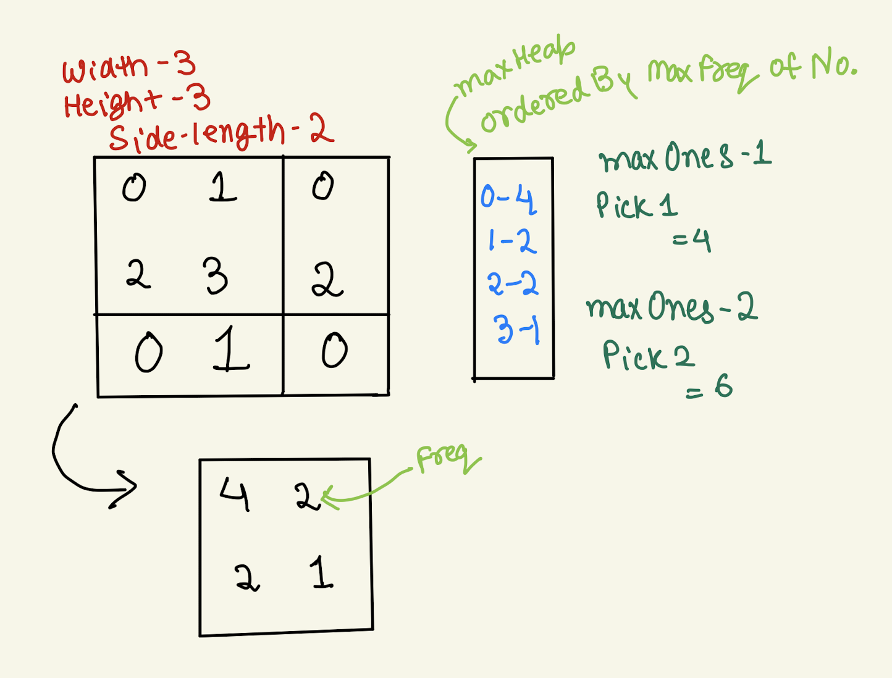

Link: [1183. Maximum Number of Ones](https://leetcode.com/problems/maximum-number-of-ones/) <br>
Tag : **Hard**<br>
Lock: **Premium**

Consider a matrix `M` with dimensions `width * height`, such that every cell has value `0` or `1`, and any **square** sub-matrix of `M` of size `sideLength * sideLength` has at most `maxOnes` ones.

Return the maximum possible number of ones that the matrix `M` can have.

**Example 1:**
```
Input: width = 3, height = 3, sideLength = 2, maxOnes = 1
Output: 4
Explanation:
In a 3*3 matrix, no 2*2 sub-matrix can have more than 1 one.
The best solution that has 4 ones is:
[1,0,1]
[0,0,0]
[1,0,1]
```
**Example 2:**
```
Input: width = 3, height = 3, sideLength = 2, maxOnes = 2
Output: 6
Explanation:
[1,0,1]
[1,0,1]
[1,0,1]
```
**Constraints:**
-   `1 <= width, height <= 100`
-   `1 <= sideLength <= width, height`
-   `0 <= maxOnes <= sideLength * sideLength`

## Detailed Intuition

### 💡 How to Think About the Solution

1. **Pattern Recognition Concept:**
   - Matrix can be divided into repeating blocks
   - Each position in base block affects multiple positions
   - Position (x,y) repeats at (x+k⋅sideLength, y+m⋅sideLength)
   - Need to maximize total ones while respecting constraints

2. **Key Insights:**
   - Focus on sideLength × sideLength base block
   - Each position contributes differently to final count
   - Use priority queue for optimal position selection
   - Pattern repeats horizontally and vertically

### 🔍 Edge Cases to Consider
- Minimum dimensions (1×1)
- Maximum dimensions (100×100)
- sideLength equals width/height
- maxOnes equals 0
- maxOnes equals sideLength²
- Non-square matrix
- sideLength equals 1
- Width/height not divisible by sideLength

### 🎯 Solution Approaches

1. **Greedy with Priority Queue**
   ```pseudo
   function maxNumberOfOnes(width, height, sideLength, maxOnes):
       contributions = []  # Store (count, x, y)
       
       # Calculate contribution of each position
       for i in range(sideLength):
           for j in range(sideLength):
               # Count repetitions of this position
               count = ((width - i - 1) // sideLength + 1) *
                      ((height - j - 1) // sideLength + 1)
               contributions.append((-count, i, j))
       
       # Sort by contribution count
       sort contributions
       
       # Take top maxOnes positions
       result = 0
       for i in range(maxOnes):
           result += -contributions[i][0]
       
       return result
   ```
   Time: O(s² log s), Space: O(s²)
   where s = sideLength

### 📈 Visual Explanation
```
Example: width=3, height=3, sideLength=2, maxOnes=1

Base Block Pattern:
[A B|A]
[C D|C]
[---+]
[A B|A]

Position Contributions:
A: Appears 4 times
B: Appears 2 times
C: Appears 2 times
D: Appears 1 time

Best Solution:
[1 0 1]
[0 0 0]
[1 0 1]

Choose 'A' position (appears most) for optimal result
```
### 🛠️ Implementation Tips
1. Use array for position counting
2. Consider matrix boundaries carefully
3. Pre-calculate repetition counts
4. Use priority queue for selection
5. Handle integer division properly

### 📊 Complexity Analysis
- Time Complexity: O(s² log s)
  - s² positions in base block
  - log s for heap operations
- Space Complexity: O(s²)
  - Store contributions for each position

### 🔗 Related Patterns
- Matrix Pattern Recognition
- Greedy Selection
- Priority Queue Usage
- Similar Problems:
  - Matrix Block Sum
  - Maximum Sum of 3 Non-Overlapping Subarrays
  - Maximum Points You Can Obtain from Cards

### 📝 Example Processing Flow
```
Input: width=3, height=3, sideLength=2, maxOnes=1

1. Calculate position contributions:
   (0,0): 4 occurrences
   (0,1): 2 occurrences
   (1,0): 2 occurrences
   (1,1): 1 occurrence

2. Sort by contribution:
   [(4,0,0), (2,0,1), (2,1,0), (1,1,1)]

3. Take maxOnes=1 positions:
   Choose (0,0) → 4 ones total

Result: 4 ones maximum
```
### ⚠️ Common Mistakes to Avoid
1. Incorrect contribution counting
2. Missing boundary positions
3. Wrong pattern repetition
4. Not considering matrix edges
5. Inefficient position selection


```
n = is width
m = is height
s = is sideLength

**Time Complexity** : O(n*m + s<sup>2</sup> log(s<sup>2</sup>))<br>
**Space Complexity** : O(s<sup>2</sup>)
**Solution:**

- [x] [[Array]]

## Visual Reference


## Detailed Intuition

- Identify the target relation for each index/value and scan once with supporting data structures if needed.
- Keep updates local and avoid recomputing previous work.
- Validate edge cases such as duplicates, empty ranges, and boundary indices.

**Time Complexity** : O(n*m + s<br>
**Space Complexity** : O(s

```java
    public int maximumNumberOfOnes(int width, int height, int sideLength, int maxOnes) {
        
        Map<String, Integer> freq = new HashMap<>();
        for (int i = 0; i < height; i++)
            for (int j = 0; j < width; j++) {
                Point point = new Point(i % sideLength, j % sideLength);
                freq.merge(point.hash(), 1, Integer::sum);
            }
        
        PriorityQueue<Integer> maxHeap = new PriorityQueue<>(Collections.reverseOrder());
        maxHeap.addAll(freq.values());
        
        int count = 0;
        for (int i = 0; i < maxOnes; i++)
            count = count + maxHeap.poll();
        return count;
    }
    class Point {
        int x, y;
        Point (int x, int y) {
            this.x = x;
            this.y = y;
        }
        public String hash() {
            return x + "|" + y;
        }
    }
```
