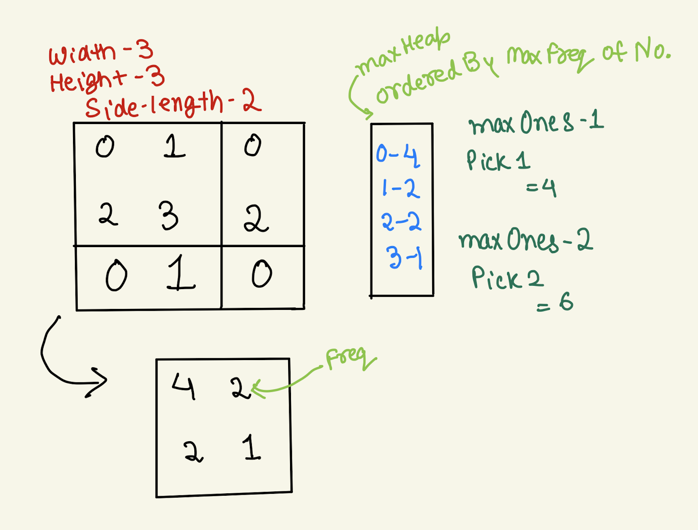

Link: [1183. Maximum Number of Ones](https://leetcode.com/problems/maximum-number-of-ones/) <br>
Tag : **Hard**<br>
Lock: **Premium**

Consider a matrix `M` with dimensions `width * height`, such that every cell has value `0` or `1`, and any **square** sub-matrix of `M` of size `sideLength * sideLength` has at most `maxOnes` ones.

Return the maximum possible number of ones that the matrix `M` can have.

**Example 1:**
```
Input: width = 3, height = 3, sideLength = 2, maxOnes = 1
Output: 4
Explanation:
In a 3*3 matrix, no 2*2 sub-matrix can have more than 1 one.
The best solution that has 4 ones is:
[1,0,1]
[0,0,0]
[1,0,1]
```

**Example 2:**
```
Input: width = 3, height = 3, sideLength = 2, maxOnes = 2
Output: 6
Explanation:
[1,0,1]
[1,0,1]
[1,0,1]
```

**Constraints:**
-   `1 <= width, height <= 100`
-   `1 <= sideLength <= width, height`
-   `0 <= maxOnes <= sideLength * sideLength`


**Solution:**

- [x] [[Heap]] + [[Greedy]]

**Intuition** :

We isolate a square at the top left position with sides = sideLength. Then we put 1 at some position (x,y) in this sqare. Our onesCount increases. If we put 1 at positions (a * sideLength + x, b * sideLength + y) our onesCount remains the same. So we just try to put 1 in the top left sqare and calculate how many more points we can have without affecting maxOnes. Then chose maxOnes number of points with maximum number of 1 it can give us.



```
n = is width
m = is height
s = is sideLength
```
**Time Complexity** : O(n*m + s<sup>2</sup> log(s<sup>2</sup>))<br>
**Space Complexity** : O(s<sup>2</sup>)

```java
    public int maximumNumberOfOnes(int width, int height, int sideLength, int maxOnes) {
        
        Map<String, Integer> freq = new HashMap<>();
        for (int i = 0; i < height; i++)
            for (int j = 0; j < width; j++) {
                Point point = new Point(i % sideLength, j % sideLength);
                freq.merge(point.hash(), 1, Integer::sum);
            }
        
        PriorityQueue<Integer> maxHeap = new PriorityQueue<>(Collections.reverseOrder());
        maxHeap.addAll(freq.values());
        
        int count = 0;
        for (int i = 0; i < maxOnes; i++)
            count = count + maxHeap.poll();
        return count;
    }
    class Point {
        int x, y;
        Point (int x, int y) {
            this.x = x;
            this.y = y;
        }
        public String hash() {
            return x + "|" + y;
        }
    }
```
