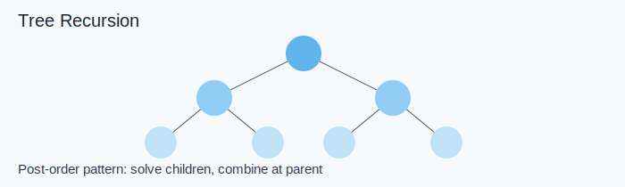

Link: [2063. Vowels of All Substrings](https://leetcode.com/problems/vowels-of-all-substrings/) <br>
Tag : **Medium**<br>
Lock: **Normal**

Given a string `word`, return _the **sum of the number of vowels** (_`'a'`, `'e'`_,_ `'i'`_,_ `'o'`_, and_ `'u'`_)_ _in every substring of_ `word`.

A **substring** is a contiguous (non-empty) sequence of characters within a string.

**Note:** Due to the large constraints, the answer may not fit in a signed 32-bit integer. Please be careful during the calculations.

**Example 1:**
```
Input: word = "aba"
Output: 6
Explanation: 
All possible substrings are: "a", "ab", "aba", "b", "ba", and "a".
- "b" has 0 vowels in it
- "a", "ab", "ba", and "a" have 1 vowel each
- "aba" has 2 vowels in it
Hence, the total sum of vowels = 0 + 1 + 1 + 1 + 1 + 2 = 6. 
```
**Example 2:**
```
Input: word = "abc"
Output: 3
Explanation: 
All possible substrings are: "a", "ab", "abc", "b", "bc", and "c".
- "a", "ab", and "abc" have 1 vowel each
- "b", "bc", and "c" have 0 vowels each
Hence, the total sum of vowels = 1 + 1 + 1 + 0 + 0 + 0 = 3.
```
**Example 3:**
```
Input: word = "ltcd"
Output: 0
Explanation: There are no vowels in any substring of "ltcd".
```
**Constraints:**
-   `1 <= word.length <= 105`
-   `word` consists of lowercase English letters.

**Solution:**

- [x] [[Greedy]]

## Visual Reference



## Detailed Intuition

- Define what each recursive call should return for a subtree.
- Combine left and right subtree results at the current node using one clear rule.
- Handle null/leaf nodes explicitly to keep recursion correct.

**Time Complexity** : O(n)<br>
**Space Complexity** : O(1)

```java
    public long countVowels(String word) {
        
        int len = word.length();
        Set<Character> vowels = new HashSet(Arrays.asList('a', 'e', 'i', 'o', 'u'));
        
        long count = 0; 
        for (long i = 0; i < len; i++)
            if (vowels.contains(word.charAt((int) i)))
                count = count + (len - i) * (i + 1);
        return count;
    }
```
