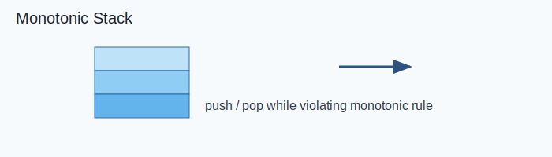

Link: [225. Implement Stack using Queues](https://leetcode.com/problems/implement-stack-using-queues/) <br>
Tag : **Easy**<br>
Lock: **Normal**

Implement a last-in-first-out (LIFO) stack using only two queues. The implemented stack should support all the functions of a normal stack (`push`, `top`, `pop`, and `empty`).

Implement the `MyStack` class:

-   `void push(int x)` Pushes element x to the top of the stack.
-   `int pop()` Removes the element on the top of the stack and returns it.
-   `int top()` Returns the element on the top of the stack.
-   `boolean empty()` Returns `true` if the stack is empty, `false` otherwise.

**Notes:**

-   You must use **only** standard operations of a queue, which means that only `push to back`, `peek/pop from front`, `size` and `is empty` operations are valid.
-   Depending on your language, the queue may not be supported natively. You may simulate a queue using a list or deque (double-ended queue) as long as you use only a queue's standard operations.

**Example 1:**
```
Input
["MyStack", "push", "push", "top", "pop", "empty"]
[[], [1], [2], [], [], []]
Output
[null, null, null, 2, 2, false]

Explanation
MyStack myStack = new MyStack();
myStack.push(1);
myStack.push(2);
myStack.top(); // return 2
myStack.pop(); // return 2
myStack.empty(); // return False
```
**Constraints:**
-   `1 <= x <= 9`
-   At most `100` calls will be made to `push`, `pop`, `top`, and `empty`.
-   All the calls to `pop` and `top` are valid.

**Follow-up:** Can you implement the stack using only one queue?

**Solution:**

- [x] [[Greedy]]

## Visual Reference



## Detailed Intuition

- Maintain a monotonic stack so each element is pushed and popped at most once.
- Pop while invariant is violated and compute contribution/answer during pops.
- Finalize remaining stack elements after traversal when required.

**Time Complexity** : O(n)<br>
**Space Complexity** : O(n)

```java
class MyStack {

    Deque<Integer> main = new LinkedList<>(),
                     temp = new LinkedList<>();
    Integer top = null;
    public MyStack() {
    }
    
    public void push(int x) {
        main.offerLast(x);
        top = x;
    }
    
    public int pop() {
        if (main.isEmpty()) return -1;
        while (main.size() > 1)
            temp.offerLast(main.pollFirst());
        int poll = main.poll();
        while (!temp.isEmpty()) {
            top = temp.pollFirst();
            main.offerLast(top);
        }
        if (main.isEmpty()) top = null;
        return poll;
    }
    
    public int top() {
        if (top == null) return -1;
        return top;
    }
    
    public boolean empty() {
        return main.isEmpty();
    }
}

/**
 * Your MyStack object will be instantiated and called as such:
 * MyStack obj = new MyStack();
 * obj.push(x);
 * int param_2 = obj.pop();
 * int param_3 = obj.top();
 * boolean param_4 = obj.empty();
 */
```
