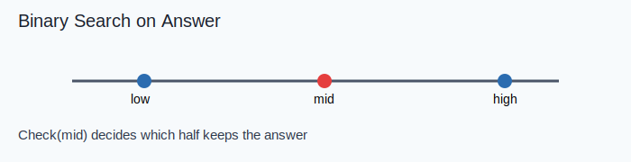

Link: [528. Random Pick with Weight](https://leetcode.com/problems/random-pick-with-weight/) <br>
Tag : **Medium**<br>
Lock: **Normal**

You are given a **0-indexed** array of positive integers `w` where `w[i]` describes the **weight** of the `ith` index.

You need to implement the function `pickIndex()`, which **randomly** picks an index in the range `[0, w.length - 1]` (**inclusive**) and returns it. The **probability** of picking an index `i` is `w[i] / sum(w)`.

-   For example, if `w = [1, 3]`, the probability of picking index `0` is `1 / (1 + 3) = 0.25` (i.e., `25%`), and the probability of picking index `1` is `3 / (1 + 3) = 0.75` (i.e., `75%`).

**Example 1:**
```
Input
["Solution","pickIndex"]
[[[1]],[]]
Output
[null,0]

Explanation
Solution solution = new Solution([1]);
solution.pickIndex(); // return 0. The only option is to return 0 since there is only one element in w.
```
**Example 2:**
```
Input
["Solution","pickIndex","pickIndex","pickIndex","pickIndex","pickIndex"]
[[[1,3]],[],[],[],[],[]]
Output
[null,1,1,1,1,0]

Explanation
Solution solution = new Solution([1, 3]);
solution.pickIndex(); // return 1. It is returning the second element (index = 1) that has a probability of 3/4.
solution.pickIndex(); // return 1
solution.pickIndex(); // return 1
solution.pickIndex(); // return 1
solution.pickIndex(); // return 0. It is returning the first element (index = 0) that has a probability of 1/4.

Since this is a randomization problem, multiple answers are allowed.
All of the following outputs can be considered correct:
[null,1,1,1,1,0]
[null,1,1,1,1,1]
[null,1,1,1,0,0]
[null,1,1,1,0,1]
[null,1,0,1,0,0]
......
and so on.
```
**Constraints:**
-   `1 <= w.length <= 104`
-   `1 <= w[i] <= 105`
-   `pickIndex` will be called at most `104` times.

**Solution:**

- [x] [[Binary Search]]

## Visual Reference



## Detailed Intuition

- Search on a monotonic condition over index/value/answer space.
- Use mid to test feasibility and move left/right boundary accordingly.
- Return the boundary that satisfies the required condition.

**Time Complexity** : O(n) O(log n) for each query<br>
**Space Complexity** : O(n)

```java
class Solution {

    int len;
    List<Integer> list;
    Random rand = new Random();
    
    public Solution(int[] indexes) {
        len = indexes.length;
        list = new ArrayList<>();
        int sum = 0;
        for (int i = 0; i < len; i++) {
            sum = sum + indexes[i];
            list.add(sum);
        }
    }
    
    public int pickIndex() {
        int index = rand.nextInt(list.get(len - 1)) + 1;
        int num = Collections.binarySearch(list, index);
        if (num < 0) num = -num -1;
        return num;
    }
}

/**
 * Your Solution object will be instantiated and called as such:
 * Solution obj = new Solution(w);
 * int param_1 = obj.pickIndex();
 */
```
