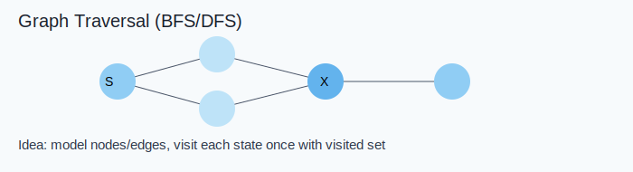

Link: [684. Redundant Connection](https://leetcode.com/problems/redundant-connection/) <br>
Tag : **Medium**<br>
Lock: **Normal**

In this problem, a tree is an **undirected graph** that is connected and has no cycles.

You are given a graph that started as a tree with `n` nodes labeled from `1` to `n`, with one additional edge added. The added edge has two **different** vertices chosen from `1` to `n`, and was not an edge that already existed. The graph is represented as an array `edges` of length `n` where `edges[i] = [ai, bi]` indicates that there is an edge between nodes `ai` and `bi` in the graph.

Return _an edge that can be removed so that the resulting graph is a tree of_ `n` _nodes_. If there are multiple answers, return the answer that occurs last in the input.

**Example 1:**


```
Input: edges = [[1,2],[1,3],[2,3]]
Output: [2,3]
```
**Example 2:**


```
Input: edges = [[1,2],[2,3],[3,4],[1,4],[1,5]]
Output: [1,4]
```
**Constraints:**
-   `n == edges.length`
-   `3 <= n <= 1000`
-   `edges[i].length == 2`
-   `1 <= ai < bi <= edges.length`
-   `ai != bi`
-   There are no repeated edges.
-   The given graph is connected.

**Solution:**

- [x] [[Union-Find]]

## Visual Reference



## Detailed Intuition

- Model the problem as nodes and edges, then choose BFS/DFS/Topological traversal based on dependency direction.
- Track visited/state to prevent repeated processing and cycles.
- Build the answer while traversing (order, count, or connectivity result).

**Time Complexity** : O(n)<br>
**Space Complexity** : O(n)

```java
    Map<Integer, Node> map;
    public int[] findRedundantConnection(int[][] edges) {
        map = new HashMap<>();
        for (int[] edge : edges) {
            if (!map.containsKey(edge[0]) || !map.containsKey(edge[1])) {
                union(edge[0], edge[1]);
            } else {
                if (find(edge[0]) != find(edge[1])) {
                    union(edge[0], edge[1]);
                } else {
                    return edge;
                }
            }
        }
        return new int[0];
    }
    
    class Node {
        int val;
        int rank = 0;
        Node parent = null;
        public Node(int val) { this.val = val; }
    }
    private void makeSet(int val) {
        if (!map.containsKey(val)) {
            Node node = new Node(val);
            node.parent = node;
            map.put(val, node);
        }
    }
    private int find(int val) {
        return findSet(map.get(val)).val;
    }
    private Node findSet(Node node) {
        if (node.parent == node) 
            return node;
        node.parent = findSet(node.parent);
        return node.parent;
    }
    private void union(int one, int two) {
        makeSet(one);
        makeSet(two);
        Node left = findSet(map.get(one));
        Node right = findSet(map.get(two));
        if (left == right) return;
        
        if (left.rank > right.rank) {
            right.parent = left;
        } else if (left.rank < right.rank) {
            left.parent = right;
        } else {
            right.parent = left;
            left.rank = left.rank + 1;
        }
    }
```
