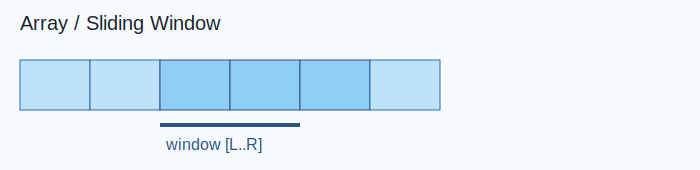

Link: [759. Employee Free Time](https://leetcode.com/problems/employee-free-time/) <br>
Tag : **Hard**<br>
Lock: **Premium**

We are given a list `schedule` of employees, which represents the working time for each employee.

Each employee has a list of non-overlapping `Intervals`, and these intervals are in sorted order.

Return the list of finite intervals representing **common, positive-length free time** for _all_ employees, also in sorted order.

(Even though we are representing `Intervals` in the form `[x, y]`, the objects inside are `Intervals`, not lists or arrays. For example, `schedule[0][0].start = 1`, `schedule[0][0].end = 2`, and `schedule[0][0][0]` is not defined).  Also, we wouldn't include intervals like [5, 5] in our answer, as they have zero length.

**Example 1:**
```
Input: schedule = [[[1,2],[5,6]],[[1,3]],[[4,10]]]
Output: [[3,4]]
Explanation: There are a total of three employees, and all common
free time intervals would be [-inf, 1], [3, 4], [10, inf].
We discard any intervals that contain inf as they aren't finite.
```
**Example 2:**
```
Input: schedule = [[[1,3],[6,7]],[[2,4]],[[2,5],[9,12]]]
Output: [[5,6],[7,9]]
```
**Constraints:**
-   `1 <= schedule.length , schedule[i].length <= 50`
-   `0 <= schedule[i].start < schedule[i].end <= 10^8`

**Solution:**

- [x] [[Heap]]

## Visual Reference



## Detailed Intuition

- Identify the target relation for each index/value and scan once with supporting data structures if needed.
- Keep updates local and avoid recomputing previous work.
- Validate edge cases such as duplicates, empty ranges, and boundary indices.

**Time Complexity** : O(n* log(n))<br>
**Space Complexity** : O(n)

```java
/*
// Definition for an Interval.
class Interval {
    public int start;
    public int end;

    public Interval() {}

    public Interval(int _start, int _end) {
        start = _start;
        end = _end;
    }
};
*/
    public List<Interval> employeeFreeTime(List<List<Interval>> schedule) {
        
        Integer prev = null;
        int count = 0;
        List<Interval> freeTime = new LinkedList<>();
        PriorityQueue<Point> minHeap = new PriorityQueue<>();
        
        for (List<Interval> intervals : schedule)
            for (Interval interval : intervals) {
                minHeap.add(new Point(interval.start, State.START));
                minHeap.add(new Point(interval.end, State.END));
            }
        
        while (!minHeap.isEmpty()) {
            Point poll = minHeap.poll();
            
            if (prev != null && count == 0) {
                if (prev != poll.index) 
                    freeTime.add(new Interval(prev, poll.index));
                prev = null;
                count = 1;
            } else {
                if (poll.state == State.START) {
                    count++;
                } else {
                    prev = poll.index;
                    count--;
                }
            }
        }
        return freeTime;
    }
    class Point implements Comparable<Point> {
        int index;
        State state;
        Point (int index, State state) {
            this.index = index;
            this.state = state;
        }
        @Override
        public int compareTo(Point that) {
            return Integer.compare(this.index, that.index);
        }
    }
    enum State {START, END}
```
