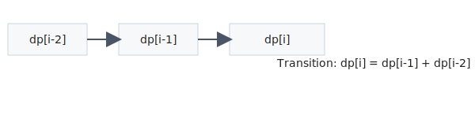

Link: [926. Flip String to Monotone Increasing](https://leetcode.com/problems/flip-string-to-monotone-increasing/) <br>
Tag : **Medium**<br>
Lock: **Normal**

A binary string is monotone increasing if it consists of some number of `0`'s (possibly none), followed by some number of `1`'s (also possibly none).

You are given a binary string `s`. You can flip `s[i]` changing it from `0` to `1` or from `1` to `0`.

Return _the minimum number of flips to make_ `s` _monotone increasing_.

**Example 1:**
```
Input: s = "00110"
Output: 1
Explanation: We flip the last digit to get 00111.
```
**Example 2:**
```
Input: s = "010110"
Output: 2
Explanation: We flip to get 011111, or alternatively 000111.
```
**Example 3:**
```
Input: s = "00011000"
Output: 2
Explanation: We flip to get 00000000.
```
**Constraints:**
-   `1 <= s.length <= 105`
-   `s[i]` is either `'0'` or `'1'`.

**Solution:**

- [x] [[Utils/Dynamic Programming]]

## Visual Reference



## Detailed Intuition

- Define DP state so each state captures the minimum information required to continue transitions.
- Write transition from previously solved states and compute in valid order.
- Initialize base cases carefully since all later states depend on them.

**Time Complexity** : O(n)<br>
**Space Complexity** : O(n)

```java
    public int minFlipsMonoIncr(String s) {
        
        int len = s.length();
        int[] oneCount = new int[len + 1];
        for (int i = 0; i < len; i++)
            oneCount[i + 1] = oneCount[i] + (s.charAt(i) == '1' ? 1 : 0);
        
        int swaps = Integer.MAX_VALUE;
        for (int i = 0; i <= len; i++)
            swaps = Math.min(swaps, oneCount[i] + len - i - (oneCount[len] - oneCount[i]));
        
        return swaps;
    }
```
